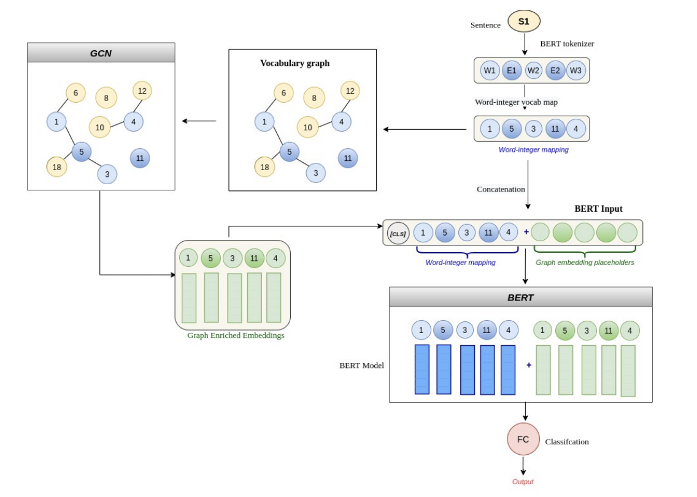

# VGCN-BERT for Relation Extraction
# Getting started
This folder contains all the necessary scripts to perform relation extraction on the merged ChemProt-DrugProt dataset using the GCN-BERT approach. This code is based on [this](https://github.com/NLPatVCU/RelEx-GCN/tree/main/GCN-BERT) repo and implements the approach detailed in [this](https://dl.acm.org/doi/fullHtml/10.1145/3487553.3524702) paper.

To run this code in your local system, setup data as outlined in the section below, make any necessary changes to the dataset configuration file under the `configs` folder and run
```
python run.py
```
## Config description
Only the config variables currently used by the GCN-BERT code are described here
### Default
* `binary_classification`: flag to specify binary vs multi-class classification. False for merged dataset
* `test` : Flag to do train-test split. If False, do 5 fold CV

### Segmentation
* `train_path` : path to the train dataset
* `test_path` : path to the test dataset. None when running 5 CV
* `rel_labels` : list of the different kinds of entities present in the dataset
* `no_relation` : flag when no-relation between entities needs to be considered
* `no_rel_label` : label for the no-relation category

### Predictions
* `initial_predictions` : path to the folder where predictions are saved temporarily
* `final_predictions` : #path to the folder to save the re-ordered predictions where the entities are already appended

### GCN models
* `embedding_dim` : BERT model's embedding dimension
* `entity_masking` : Mask the other entities except the target entities in a sentence
* `replace_entity_pair` : Replace the target entity pair in the sentence with its label
* `window_size` : window size for building the vocabulary graph

To train on nautilus, use the `gpu-job.yaml` file

## Dataset description

[ChemProt](https://biocreative.bioinformatics.udel.edu/news/corpora/chemprot-corpus-biocreative-vi/)

[DrugProt](https://zenodo.org/record/5119892#.YdyOd_7MIUE)

Merged (created by merging ChemProt and DrugProt)
The following dataset preprocessing steps assume that the data is present in the following structure.

```
merged
    + merged
        + training_original
            + merged.json
            + merged.txt
        + dev
            + merged.json
            + merged.txt
```

**training-original** contains the original training data; **dev** contains the original development set. 
To get these merged josn and txt files, refer to [this repo] (https://gitlab.com/mhn-ucsd/sbks-ucsd/-/tree/master/relation-extraction#data-processing-pipeline)

# Dataset Pre-processing

Our code expects the data to be in ANN format with ann and txt files for each document in the same folder.
The files in the `GCN-BERT\dataset_preprocessing` folder help generate data in the specified format.
The input_to_annbrat script takes the path to the JSON file, the path to the input file and an output folder and generates .ann files and .txt files for each abstract in the given JSON file within the specified folder

```
input_to_annbrat.py --json_filename JSON_PATH --input_file INPUT_PATH --ann_folder FOLDER_PATH
```

* `JSON_PATH`: path to the json dataset file
* `INPUT_PATH`: path to input.txt file
* `FOLDER`: the output folder for .ann files

(Example) Generate the train folder

```
python input_to_annbrat.py ../../data/merged/training_original/merged.json ../../data/merged/training_original/merged.txt ../../data/merged/train
```

# Relation Extraction Model
The VGCN-BERT method builds a vocabulary graph which is encoded by a GCN. This encoded input is combined with word embeddings and the total transformed sentence input is passed to a BERT model and finally, a classifier. The hypothesis was that for document-level relation extraction, the vocabulary graph which was built using Pointwise Mutual Information between words will provide additional information about word context in the document. The model diagram is as follows:




## Data processing logic in `GCN-BERT\data_prep` and `GCN-BERT\segment` folders

### dataset.py
An iterator over all data files in the given data directory

### annotation.py
Given an ann file, it stores 
1. All the entities in the file in a dict with key as the identifier in the ann file and value as (entity_label, entity_start, entity_end, name)
2. All relations in the file in a list with values (relation_name, relation_start, relation_end)

### segmentation.py
Data files are read as input and the sentences where the entity pair is located is segmented into five segments
along with the labels and the track information (file number, entity1 and entity 2) that helps to write predictions
into the output files.

## Model details in `GCN-BERT\model` folders
### model.py
The data is processed to mask the entities as specified in config

### clean_data.py
Combine train and test data. Remove stop words and tokenize the text

### build_graph.py
The cleaned train, valid and test data is processed to count the occurences of word pairs within a window.
This count of occurences is used to calculate normalized PMI and build a vocabulary graph
The adjacency matrix of the computed vocabulary graph is stored in CSR sparse matrix format

## train_vgcn_bert.py
This file contains the main training logic of the RE model. The hardcoded default hyperparameters of this model are defined here:
* `epochs`: total number of training epochs = 15
* `warm-up-proportion`: percentage of steps in warm up stage for the Linear LR scheduler = 0.1
* `lr`: initial learning rate = 3e-5
* `batch-size`: number of samples per forward pass during training = 8
* `bert-state-path`: path to the pretrained bert directory = '/sbksvol/jiawei/re-model-data/weights/biobert_base_v1.0_torch'
* `l2_decay`: 0.001
* `dropout` : 0.2
* `gcn_embedding_dim` : dimension of the output of GCN model = 16
* `npmi_threshold` : Threshold of the PMI value for including the edge in the vocabulary graph = 0.2

