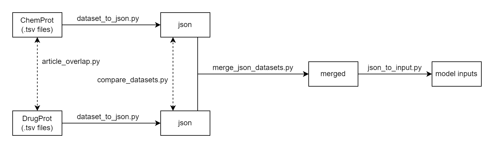
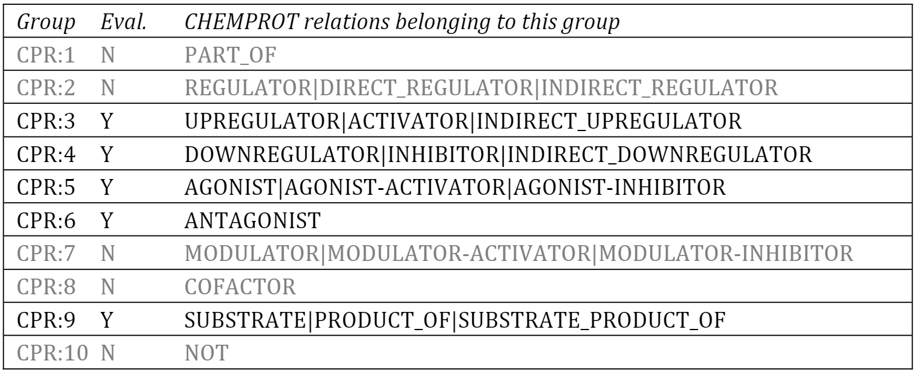
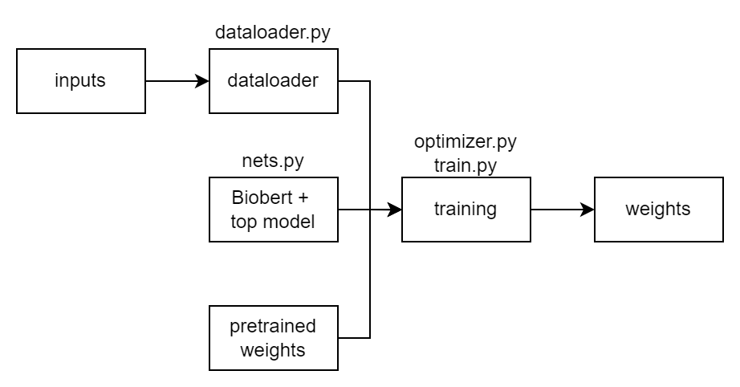
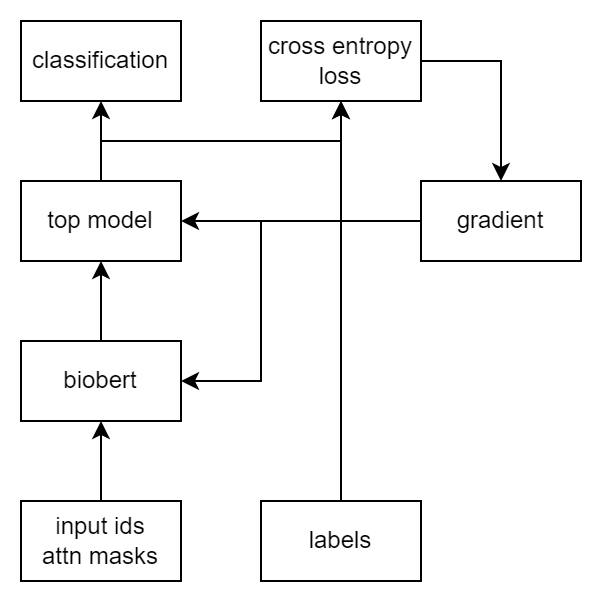
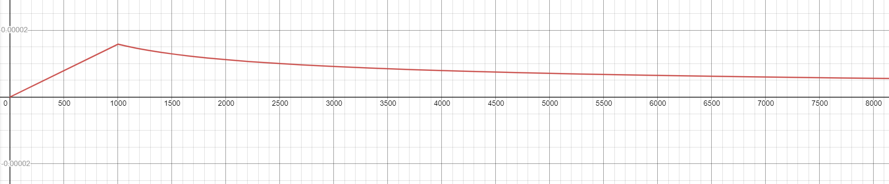
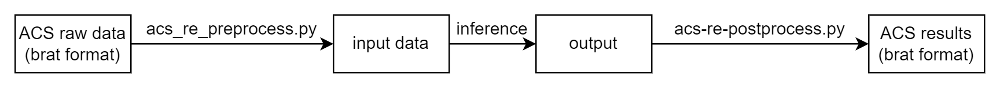

# Getting started

This folder contains all the necessary scripts to perform relation extraction on DrugProt and ChemProt

* `assets`: contains figures and diagrams for this README
* `biobert_RE/dataset_processing`: contains dataset preprocessing codes that convert raw DrugProt and ChemProt data into training/testing datasets
* `biobert_RE/acs_data_processing`: containts the data proprocessing codes for ACS inference
* `biobert_RE/models`: dataloader, RE model definition, and training logics
* `biobert_RE/utils`: frequently used utility function
* `biobert_RE_chemprot`: legacy code for ChemProt datasets, functionalities are already integrated into the new module `biobert_RE`
* `docker`: contains DockerFile used to build containers to run RE models on Nautilus, and yaml files for batch training job on Nautilus

## Environment setup

Run the following command to setup via Anaconda. For PyTorch installation, make sure the pick the correct cudatoolkit version for your GPU.

```
conda create -n torch python=3.8
conda activate torch
conda install -y scipy=1.6.1
conda install -y -c conda-forge notebook scikit-learn tqdm matplotlib ipywidgets
conda install -y -c pytorch pytorch torchvision torchaudio cudatoolkit=11.3
conda install -y -c huggingface transformers
```

Run this to install SciSpacy models. If the second command failed to install en_core_sci_sm due to SciSpacy version constraints, check [here](https://allenai.github.io/scispacy/) for the latest en_core_sci_sm model.

```
pip install scispacy==0.4.0
pip install https://s3-us-west-2.amazonaws.com/ai2-s2-scispacy/releases/v0.4.0/en_core_sci_sm-0.4.0.tar.gz
```

## Setting path variable

Make sure the append the path to folder (relation-extraction/biobert_RE) to `PYTHONPATH`. You will get local package not found errors if it is not set up correctly.

## Data source

[ChemProt](https://biocreative.bioinformatics.udel.edu/news/corpora/chemprot-corpus-biocreative-vi/)

[DrugProt](https://zenodo.org/record/5119892#.YdyOd_7MIUE)

Recommended: after downloading the zip files, unzip them and place them under `relation-extraction/data`. This tutorial will assume the following file structure:

```
relation-extraction
    + data
        + ChemProt
        + DrugProt
```

Check to make sure both datasets have development set and traing set.

ChemProt has also been processed by [Sun et. al.](https://arxiv.org/abs/1911.09487). We are currently not using this processed version and choose to process ChemProt data by ourselves because Sun's version only has CPR 3,4,5,6 and 9.

## Pretrained weights

[BioBert](https://github.com/dmis-lab/biobert)

Use `transformers-cli` binary come with the `transformers` package to convert Tensorflow weights to PyTorch weights

**All the example code snippets this tutorial are to be run from this folder.**

## (Optional) Debugging with VSCode

First, make sure use your VSCode's "Files -> Open Folders..." options to open `relation-extraction` folder (Note: not the root folder of this project, it's `sbks-ucsd/relation-extraction`). To set up vscode debugging with argument, [create run configurations](https://code.visualstudio.com/docs/python/debugging). You see the existing run configuration in `.vscode/launch.json`

# Data Processing Pipeline

This section is about everything in `biobert_RE/dataset_processing`. The two goals of the data processing pipeline are:

1. Merging ChemProt and DrugProt datasets
2. Convert the raw data into inputs to relation extraction models

A diagram of the pipeline:



## article_overlap.py

This script counts the number of articles in each datasets, the number of articles only appear in one dataset (differences), and the number of articles appear in both dataset (intersection). It is used for analyzing the datasets and does not transform/process the data. The usage is as the following:

```
article_overlap.py abs_filename1 abs_filename2
```

* `abs_filename1`: path to the first abstract tsv file
* `abs_filename2`: path to the second abstract tsv file

(Example) Count the number of unique/common articles between ChemProt train dataset and DrugProt  train dataset:

```
python biobert_RE/dataset_processing/article_overlap.py data/ChemProt/training/chemprot_training_abstracts.tsv data/DrugProt/training/drugprot_training_abstracts.tsv
```

### Note

1. article_ids are used to compute overlap since they are unique even across datasets.

## dataset_to_json.py

Both the ChemProt and DrugProt consists of at least three tsv files. They are abstracts, entities, and relations tsv files. This script reads in the three tsv files and converts them into a single json dataset file while performing serveral sanity checks to make sure the raw tsv files are in good format. Converting the original ChemProt and DrugProt into json datasets significantly simplifies the dataset merging step.

```
dataset_to_json.py ent_file, rel_file, abs_file -o out_file [-v]
```

* `ent_file`: path to entity tsv file
* `rel_file`: path to relation tsv file
* `abs_file`: path to abstract tsv file
* `-o out_file`: path to write the json file output
* `-v`: verbose mode

(Example) Convert ChemProt training to json format:

```
python biobert_RE/dataset_processing/dataset_to_json.py data/ChemProt/training/chemprot_training_entities.tsv data/ChemProt/training/chemprot_training_relations.tsv data/ChemProt/training/chemprot_training_abstracts.tsv -o data/ChemProt/training/chemprot_training.json
```

The content of the json file are as the following:

```
{
    <article id (string)>: {
        "abstracts": [
            {
                "text": <a sentence (string)>,
                "start": <start position of the sentence in characters (int)>,
                "end": <end position of the sentence in characters, exclusive (int)>,
                "entities": [
                    {
                        "id": <article-unique id of this entity (string)>,
                        "text": <actual text of this entity (string)>,
                        "type": <type of this entity (string)>,
                        "start": <start position of this entity in characters (int)>,
                        "end": <end position of this entity in characters (int)>
                    }, ...
                ],
                "relations": [
                    {
                        "rel_type": <type of this relation (string)>,
                        "ent_id1": <id of the first entity in this relation (string)>,
                        "ent_id2": <id of the second entity in this relation (string)>,
                        "start": <start position of this relation in characters (int)>,
                        "end": <end position of this relation in characters (int)>
                    }, ...
                ]
            }, ...
        ]
    }, ...
}
```

### Note

1. The first item of the array abstracts is always the title of the article. We put it like this because the spans are relative to the begining of the title.
1. All starts and ends are global position relative the first character in the title.
2. For relations, the entity with ent_id1 isn't guarenteed to precede the entity with ent_id2
3. However, both the entities and relations array are sorted according to their starting position.
3. The start and end (span) of a relation if defined by `min(start of ent_id1, start of ent_id2)`, `max(start of ent_id1, start of ent_id2)` respectively. This is used to check relations that span across multiple sentences (This should not happen, but as discussed on 2021-10-28 in the [meeting note](https://docs.google.com/document/d/15pfeEnx7NxEfTdIYVHPnDhQzBGS7rff-eY1datWWuR4/edit), sometimes SciSpacy makes mistakes during sentence splitting. When this happens, relations spanning multiple sentences are discarded.)

## compare_datasets.py

This script goes through two json datasets A and B, and if it finds an article that exists in both dataset A and dataset B, it will compare their texts, entities, and relations and print out any differences. By supplying an optional path argument `brat_diff_dir`, the script will output the entity and relation differences in brat format (.txt and .ann) under the supplied path.

```
compare_datasets.py [-d brat_diff_dir] json_filename1 json_filename2
```

* `json_filename1`: path to the first json dataset
* `json_filename2`: path to the second json dataset
* `-d brat_diff_dir`: path to write the article differences in brat format

(Example) Find all the entity and relation differences for all articles that exists in both ChemProt  train and DrugProt train datasets, and output the result in brat format to `cp_vs_dp/train`:

```
python biobert_RE/dataset_processing/compare_datasets.py data/ChemProt/training/chemprot_train.json data/DrugProt/training/drugprot_train.json -d cp_vs_dp/train
```

## merge_json_datasets.py

Merge one json dataset with others. Articles that are unique across datasets are added without modification, and articles that exists in multiple datasets are added by merging their relations together. **This script only merges relations so it assumes the texts and entities are identical** (For ChemProt and DrugProt this is the case, but for future datasets cautions are needed to make sure the assumption still holds). During the merging process, specific relation classes are mapped to CPR-X classes.



The usage of the script is as the following:

```
merge_json_datasets.py --datasets dataset1 [dataset2 ...] --output output_path
```

* `--datasets dataset1 [dataset2 ...]`: a list of json dataset (dataset1, dataset2, ...) to be merged together
* `--output output_path`: the path to write the resulting merged dataset

(Example) Merging ChemProt and DrugProt training together:

```
python biobert_RE/dataset_processing/merge_json_dataset.py --datasets data/ChemProt/training/chemprot_train.json data/DrugProt/training/drugprot_train.json --output data/merged/training/merged.json
```

### Note
1. [Meeting note on 2021-12-16](https://docs.google.com/document/d/15pfeEnx7NxEfTdIYVHPnDhQzBGS7rff-eY1datWWuR4/edit): There are some disagreement between the ChemProt and DrugProt, since the number of disagreement is small, they are discarded.

## json_to_input.py

This script converts json dataset to inputs that can be passed into RE models. It go though all the chemical-gene relations and generate an input sentence for each. The chemical and gene in the input sentence are masked by generic tokens `@CHEMICAL#` and `@GENE#` respectively. To generate negative samples (the NOT relation), It generate input sentences with the NOT label for every chem-gene entity pair that is not identified to have a relation between them.

```
json_to_input.py [-i target_id] json_filename out_filename
```

* `json_filename`: path to the json dataset file
* `out_filename`: path to write the output
* `-i target_id`: if given, will only process the article whose article_id == target_id (useful for debug)

(Example) Turn the merged json dataset to inputs

```
python biobert_RE/dataset_processing/merge_json_dataset.py data/merged/training/merged.json data/merged/training/merged.txt
```

The content of the output is a tsv file with the following columns in order:

1. input_id
2. label
3. input (masked) sentence
4. original sentence

### Note

1. The format of input_id of positive sample is: `{article id}_{sentence index}_{relation index}`. For example, an input_id of 123_0_2 means this sentence is generated from the third relation in the first sentence of the article whose article_id is 123.
2. The format of input_id of negative sample is: `{article id}_{sentence index}_{entity index 1}_{entity index 2}`. For example, an input id of 321_1_0_1 corresponds to a negative sentence generated by masking the first and the second entities in the second sentence of the article whose article_id is 321.

# Relation Extraction Model
This section is about everything in `biobert_RE/models`. The module diagram is as the following:



## train.py

This file contains the main training logic of the RE model. It accepts many optional parameters to help configurate the experiment. 

```
train.py 
        [--epochs EPOCHS] 
        [--valid-freq VALID_FREQ] 
        [--warm-up WARM_UP] 
        [--lr LR]
        [--batch-size BATCH_SIZE] 
        [--valid-batch-size VALID_BATCH_SIZE] 
        [--ga-batch-size GA_BATCH_SIZE]
        [--dataloader-workers DATALOADER_WORKERS] 
        [--seq-len SEQ_LEN] 
        [--bert-state-path BERT_STATE_PATH]
        [--use-bert-large USE_BERT_LARGE] 
        [--top-hidden-size TOP_HIDDEN_SIZE [TOP_HIDDEN_SIZE ...]]
        [--freeze-bert FREEZE_BERT] 
        [--resume-from-ckpt RESUME_FROM_CKPT]
        [--resume-from-step RESUME_FROM_STEP] 
        [--train-data TRAIN_DATA] 
        [--inference-data INFERENCE_DATA]
        [--ckpt-dir CKPT_DIR] 
        [--balance-dataset BALANCE_DATASET] 
        [--do-train DO_TRAIN]
        [--do-inference DO_INFERENCE]
```

* `epochs`: total number of training epochs
    * Regardless of `valid-freq`, a validation run will be performed after the final epoch.
* `valid-freq`: number of steps between every validation run
    * For example, if `valid-freq` is set to 1000, after 1000, 2000, ... steps, this script will perform a validation on the model. One step is one call to the `step()` method of the optimizer
* `warm-up`: number of steps in warm up stage
    * `lr = lr_factor * min(step ** (-0.5), step * warm_up ** (-1.5))`
    * Adjust `lr_factor` using the `lr` option.
    * This option is ignore if `freeze-bert` is True
* `lr`: learning rate/variable lr factor (see note)
    * If `freeze-bert` is False, this will set the `lr_factor` above.
    * If `freeze-bert` is True, this will set the learning rate of the optimizer.
* `batch-size`: number of samples per forward pass during training
* `valid-batch-size`: number of samples per forward pass during validation
    * We usually can fit more sample per batch during validation because it doesn't cost as much memory.
    * If not specified, it will be set to `batch-size`
* `ga-batch-size`: (gradient accumulation) minimum number of samples the model sees before an update step
    * There is a counter in the script counting how many samples the model has seen since the last step. If the count is greater or equal to `ga-batch-size`, the model will take a step, and the counter will be zeroed.
    * If not specified, it will be set to `batch-size`
* `dataloader-workers`: number of CPU threads dedicated to data loading
* `seq-len`: maximum input sentence length
    * Anything longer than `seq-len` is truncated.
* `bert-state-path`: path to the pretrained bert directory
* `use-bert-large`: whether to use bert large instead of bert base
* `top-hidden-size`: array of integer specifying the size of each hidden layer
    * the length of the array determines the number of hidden layers
* `freeze-bert`: whether to freeze the weights of the entire bert encoder
    * Achieved by disabling the gradient of bert.
* `resume-from-ckpt`: path to the saved checkpoint
* `resume-from-step`: number of steps the saved checkpoint has made
    * Doesn't matter if you are resuming for top model training.
    * **Does matter** if you are resuming for end-to-end training, this tells the optimizer to calculate the learning rate correctly.
* `train-data`: path to the input data
    * ignored when `do-train` is false
* `inference-data`: path to the data for inference task (e.g. ACS data)
    * ignored when `do-inference` is false
* `balance-dataset`: whether or not to use stratified sampling during training
* `do-train`: train the model on train data
* `do-inference`: make prediction on the inference data with the model
    * by setting `do-train` and `do-inference` to True, you can train and predict in one go
    * if you want to do prediciton using a specific checkpoint, set `do-train` to False and make sure to set the `resume-from-ckpt` parameter
* `ckpt-dir`: path to the folder that stores model as checkpoints

### Example output

The validation output looks like the following:

```
---Results---
Total tested: 1600.0
ACC: 0.711875
Precision: [nan, nan, nan, 0.38652482269503546, nan, nan, nan, 0.7814871016691958]
Recall: [0.0, 0.0, 0.0, 0.6193181818181818, 0.0, 0.0, 0.0, 0.9221128021486124]
F1 Scores [nan, nan, nan, 0.4759825327510917, nan, nan, nan, 0.8459958932238193]
Confusion Matrix:
[[   0.    0.    0.    0.    0.    0.    0.   24.]
 [   0.    0.    0.   13.    0.    0.    0.   61.]
 [   0.    0.    0.   27.    0.    0.    0.   38.]
 [   0.    0.    0.  109.    0.    0.    0.   67.]
 [   0.    0.    0.    7.    0.    0.    0.    8.]
 [   0.    0.    0.   27.    0.    0.    0.   17.]
 [   0.    0.    0.   12.    0.    0.    0.   73.]
 [   0.    0.    0.   87.    0.    0.    0. 1030.]]
```

Precision, recall, and F1 are k element vectors, where the i-th element is the class-wise precision, recall and F1 scores, respectively. The columns of confusion matrix are predictions and rows are ground truth. The example output above is captured from a very early stages of training. The confusion matrix indicates the model is classifying most of the samples as class 3 and 7.

## dataloader.py

Dataloader loads the output of json_to_input.py into memory, uses wordpiece tokenizer to tokenize them into token ids, and create mini batches for training the model.

## nets.py

Model diagram:



### Top model

Top model consists of N hidden layers and 1 output layer. The activation function is Tanh, and there is a dropout layer before every layers. The width and depth of the top model is configurable via the training script.

## optimizer.py

Implement variable learning for the bert model. This is enabled only during end-to-end training. The learning rate is calculated as

```
lr = lr_factor * min(step ** (-0.5), step * warm_up ** (-1.5))
```

The following is the learning rate curve with lr_factor=0.0005, warm_up=1000. During the warm up stage, the learning rate increases linearly. Once the warm up finishes, the learning rate is equal to the inversed squared-root of step count.



# ACS Data Processing

This module contains all the necessary codes to run inference on ACS data. The overall workflow of the ACS inference task is as follows:



## acs-re-preprocess.py

This scripts reads ACS data with NER annotation in brat format, converts them into model inputs.

```
acs_re_preproess.py --dataset-dir DATASET_DIR
```

* `dataset-dir`: the directory to the ACS data in brat format

### Note

The ACS data folder has to be in a specific structure for this script to work. Namely, the .txt and .ann files need to be group into separate sub-folders by their article ids. For example:

```
acs-data-folder
    + 00001
        + 00001.txt
        + 00001.ann
    + 00002
        + 00002.txt
        + 00002.ann
    ...
```

Once the script finishes, a `re_input.tsv` will be created under each sub-folder:

```
acs-data-folder
    + 00001
        + 00001.txt
        + 00001.ann
        + re_input.tsv
    + 00002
        + 00002.txt
        + 00002.ann
        + re_input.tsv
    ...
```

You can leave the .tsv files as they are; the `train.py` script will handle the dataloading.

## acs-re-postprocess.py

Once the model finishes inference, a `re_output.tsv` will be created underr each sub-folder:

```
acs-data-folder
    + 00001
        + 00001.txt
        + 00001.ann
        + re_input.tsv
        + re_output.tsv
    + 00002
        + 00002.txt
        + 00002.ann
        + re_input.tsv
        + re_output.tsv
    ...
```

Running this scripts will put all the results in re_output.tsv back into the .ann files. At the end the .ann file should have relations detected by the model.

```
acs_re_postproess.py --dataset-dir DATASET_DIR
```

* `dataset-dir`: the directory to the ACS data.